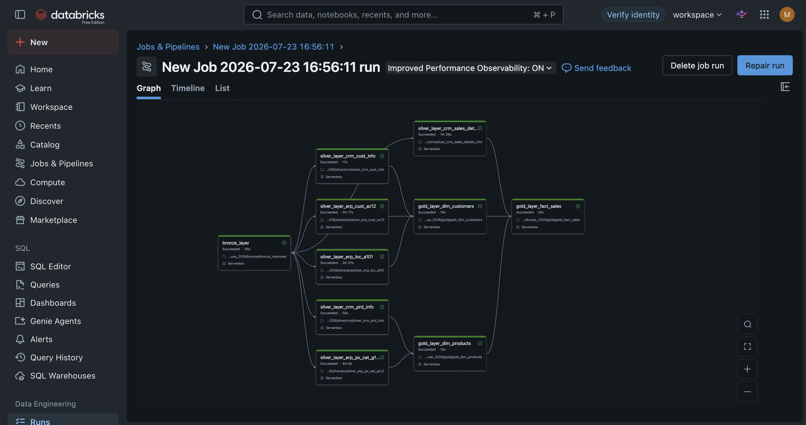

# 🚀 Databricks Medallion Lakehouse Pipeline
An end-to-end Databricks Lakehouse project that ingests operational data from CRM and ERP source systems, transforms it through **Bronze**, **Silver**, and **Gold** layers, and publishes analytics-ready tables for Databricks SQL and BI dashboards.

The project demonstrates a practical implementation of the **Medallion Architecture** using PySpark, Spark SQL, Delta Lake, Unity Catalog, and dependency-based orchestration.

## 📋 Project Overview
This project implements a multi-layer batch data pipeline in Databricks to process raw sales-related data from two operational source systems:
- **CRM** : customer, product, and sales data
- **ERP** : customer attributes, locations, and product categories


The pipeline converts raw CSV files into governed Delta tables and then builds a dimensional model for reporting and analysis.

The main flow is:

CRM and ERP CSV files
          ↓
Bronze Delta tables
          ↓
Cleaned and standardized Silver tables
          ↓
Gold dimensions and sales fact table
          ↓
Databricks SQL queries and sales dashboard


## 🎯 Why This Architecture?
This design separates ingestion, transformation, and business modeling into independent layers. It provides:
- **Scalability** — Spark and Delta Lake support distributed processing and growing data volumes.
- **Traceability** — raw source data remains available in the Bronze layer for auditing and troubleshooting.
- **Data quality** — cleansing, validation, type casting, and standardization are handled before business consumption.
- **Fault isolation** — failures can be identified at a specific pipeline layer or task.
- **Controlled execution** — downstream tasks run only after their upstream dependencies complete successfully.
- **Analytics readiness** — Gold tables are organized for SQL analysis, dashboarding, and BI workloads.
- **Governance** — Unity Catalog provides catalog, schema, table, and volume organization.


## 🏗️ Architecture

flowchart LR

    CRM[(CRM CSV Files)] --> B[Bronze Layer]
    ERP[(ERP CSV Files)] --> B

    B --> SC[Silver CRM Tables]
    B --> SE[Silver ERP Tables]

    SC --> DC[Gold: dim_customers]
    SE --> DC

    SC --> DP[Gold: dim_products]
    SE --> DP

    SC --> FS[Gold: fact_sales]
    DC --> FS
    DP --> FS

    DC --> SQL[Databricks SQL]
    DP --> SQL
    FS --> SQL
    SQL --> DASH[Sales Dashboard]

## 🔄 Pipeline Orchestration

The pipeline is executed as a dependency-based Databricks Job. Downstream tasks run only after their upstream dependencies complete successfully.



*Databricks Job dependency graph for the Bronze, Silver, and Gold pipeline layers.*

# 🏅 Medallion Layers

## 🥉 Bronze Layer

The Bronze layer ingests the source CSV files without applying business transformations.

Responsibilities:

- Read raw CRM and ERP files from a Unity Catalog volume
- Infer the source schema
- Preserve source-level data for traceability
- Write managed Delta tables to `workspace.bronze`


Source files configured in `bronze_config.py`:
```
| Source | File                | Bronze table          |
|--------|---------------------|-----------------------|
| CRM    | `cust_info.csv`     | `crm_cust_info_raw`   |
| CRM    | `prd_info.csv`      | `crm_prd_info_raw`    |
| CRM    | `sales_details.csv` | `sales_details_raw`   |
| ERP    | `CUST_AZ12.csv`     | `erp_cust_az12_raw`   |
| ERP    | `LOC_A101.csv`      | `erp_loc_a101_raw`    |
| ERP    | `PX_CAT_G1V2.csv`   | `erp_px_cat_g1v2_raw` |
```

The default source volume path is:

`/Volumes/workspace/bronze/source_systems`


## 🥈 Silver Layer

The Silver layer converts raw source data into clean, standardized, domain-oriented datasets.

Responsibilities:


- Clean invalid or inconsistent values

- Standardize column names and formats

- Cast columns to appropriate data types

- Validate dates, identifiers, and business fields

- Apply reusable business rules

- Organize transformations by CRM and ERP domains


Silver notebooks cover:

**CRM**
- Customer information
- Product information
- Sales transaction details

**ERP**
- Customer attributes
- Customer locations
- Product categories

The resulting Silver datasets consumed by the Gold layer include:

- `silver.crm_customers`
- `silver.crm_products`
- `silver.crm_sales`
- `silver.erp_customers`
- `silver.erp_customer_location`
- `silver.erp_product_category`

## 🥇 Gold Layer

The Gold layer applies business transformations and publishes analytics-ready Delta tables.
It builds a dimensional model containing:

```
| Table                          | Type      | Purpose                                                                 |
|--------------------------------|-----------|-------------------------------------------------------------------------|
| `workspace.gold.dim_customers` | Dimension | Combines CRM customer data with ERP demographic and location attributes |
| `workspace.gold.dim_products`  | Dimension | Combines product details with ERP category and maintenance information  |
| `workspace.gold.fact_sales`    | Fact      | Stores sales measures and references customer and product dimensions    |
```


The Gold layer is designed for:
- Databricks SQL
- Exploratory data analysis
- BI dashboards
- Business reporting
- Sales performance analysis


## 🔗 Execution Flow
The pipeline can be executed as a dependency-based Databricks Job. Each downstream task should run only when its required upstream tasks have completed successfully.
flowchart TD

    A[Bronze ingestion] --> B1[Silver CRM customers]
    A --> B2[Silver CRM products]
    A --> B3[Silver CRM sales]
    A --> B4[Silver ERP customers]
    A --> B5[Silver ERP locations]
    A --> B6[Silver ERP product categories]

    B1 --> C1[Gold customer dimension]
    B4 --> C1
    B5 --> C1

    B2 --> C2[Gold product dimension]
    B6 --> C2

    B3 --> C3[Gold sales fact]
    C1 --> C3
    C2 --> C3

    C3 --> D[SQL queries and dashboard]

The repository also contains orchestration notebooks that provide single entry points for the Silver and Gold layers:
    
- `silver/silver_orchestration.ipynb`
- `gold/gold_orchestration.ipynb`

The Gold orchestration notebook runs the customer dimension, product dimension, and sales fact notebooks in sequence.

## 📁 Project Structure

```
.
├── datasets/
│   ├── analyst/
│   │   ├── hr_dataset/
│   │   └── sales_dataset/
│   └── engineer/
│       ├── source_crm/
│       └── source_erp/
├── scripts/
│   ├── data_analysis/
│   │   ├── dashboards/
│   │   │   ├── EDA Sales Data.lvdash.json
│   │   │   ├── Sales-Dashboard-1.png
│   │   │   └── Sales-Dashboard-2.png
│   │   └── queries/
│   └── data_engineering/
│       └── bike_lakehouse_2026/
│           ├── bronze/
│           │   ├── bronze_basic.ipynb
│           │   ├── bronze_config.py
│           │   └── bronze_improved.ipynb
│           ├── silver/
│           │   ├── crm/
│           │   ├── erp/
│           │   └── silver_orchestration.ipynb
│           └── gold/
│               ├── gold_dim_customers.ipynb
│               ├── gold_dim_products.ipynb
│               ├── gold_fact_sales.ipynb
│               └── gold_orchestration.ipynb
├── LICENSE
└── README.md
 ```

## 🛠️ Technologies Used

- **Databricks** — development, compute, workflows, SQL, and dashboarding
- **Apache Spark** — distributed data processing
- **PySpark** — DataFrame-based ingestion and transformation
- **Spark SQL** — joins, business transformations, validation, and analysis
- **Delta Lake** — reliable table storage and schema management
- **Unity Catalog** — catalogs, schemas, volumes, tables, and governance
- **Databricks Jobs** — dependency-based pipeline orchestration
- **Git and GitHub** — source control and project documentation

## 🎓 Learning Outcomes

- By exploring this project, you can learn how to:
- Design a Bronze–Silver–Gold pipeline
- Ingest CSV data into Delta Lake
- Organize datasets with Unity Catalog
- Clean and standardize data with PySpark and Spark SQL
- Combine CRM and ERP data
- Build dimension and fact tables
- Orchestrate dependent Databricks tasks
- Query Gold tables with Databricks SQL
- Build a dashboard on top of a Lakehouse model
- License
- This project is licensed under the MIT License.


## 📄 License

This project is licensed under the MIT License.

